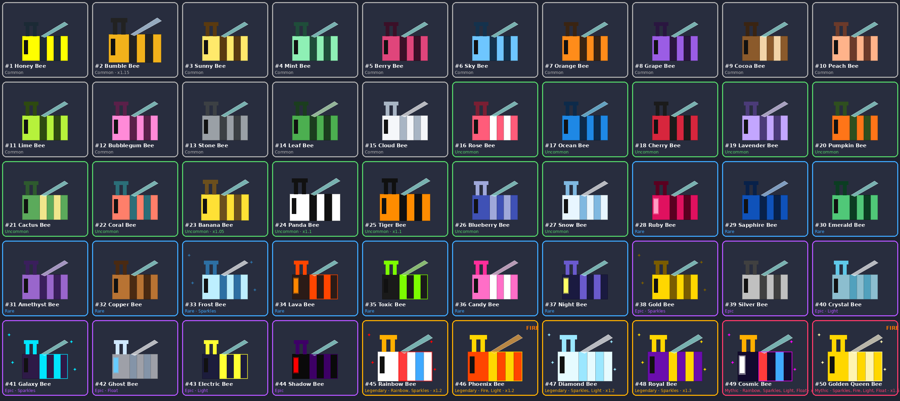

# Bee variants (50 launch bees)

Every bee is built from **one model**, `BeeTemplate.rbxm` (your original bee). The script recolours it, changes the material, scales it and adds effects. Fixing the base bee's shape later fixes all 50 at once.



## Files

| File | Roblox type | Where it goes |
|---|---|---|
| `BeeTemplate.rbxm` | Model | `ReplicatedStorage`, renamed to **BeeTemplate** |
| `BeeVariants.lua` | ModuleScript | `ReplicatedStorage.BeeVariants` |
| `BeeBuilder.lua` | ModuleScript | `ReplicatedStorage.BeeBuilder` |
| `GenerateBees.server.lua` | Script | `ServerScriptService.GenerateBees` |

## Setup in Studio (about 2 minutes)

1. Right‑click `ReplicatedStorage`, choose **Insert from File…**, pick `BeeTemplate.rbxm`, then rename the model to `BeeTemplate`.
2. Create the two ModuleScripts and the Script from the table above, and paste in each file's contents.
3. Press **Play**. All 50 bees line up in front of spawn with name tags, and they're also saved into `ReplicatedStorage.Bees`.
4. To keep the bees as real models, copy `ReplicatedStorage.Bees` while Play is running, stop Play, and paste it back. After that you can set `SHOWROOM = false` or delete the script.

## Using them in your game

```lua
local BeeVariants = require(ReplicatedStorage.BeeVariants)
local BeeBuilder  = require(ReplicatedStorage.BeeBuilder)

-- hatch an egg (luck > 1 makes rare bees more likely)
local bee   = BeeVariants.Roll(nil, 1)
local model = BeeBuilder.Build(ReplicatedStorage.BeeTemplate, bee)  -- or "Tiger Bee", or 25
model.Parent = workspace
print(bee.Name, bee.Rarity, bee.HoneyPerSecond, bee.SellValue)

BeeBuilder.StartEffects() -- call once; runs the Rainbow + Float animations
```

Each built model has these attributes: `BeeId`, `BeeName`, `Rarity`, `HoneyPerSecond`, `SellValue`.

## The lineup

| Rarity | Count | Odds (whole tier) | Honey/s |
|---|---|---|---|
| Common | 15 | 60% | 1 – 3.1 |
| Uncommon | 12 | 25% | 5 – 13.3 |
| Rare | 10 | 10% | 15 – 35.3 |
| Epic | 7 | 4% | 45 – 85.5 |
| Legendary | 4 | 0.9% | 150 – 217.5 |
| Mythic | 2 | 0.1% | 600 – 690 |

You can rebalance all 50 from the `Rarities` table at the top of `BeeVariants.lua` (`Weight`, `BaseHoney`). To add bee #51, add one more line to the list.

Each bee can set these options: `Body`, `Stripe`, `Wing`, `Eye`, `Antenna` (hex colours), `Material`, `Reflectance`, `Transparency`, `Scale`, `NeonStripes`, `GlowEyes`, and `Effects` (`Sparkles`, `Fire`, `Light`, `Rainbow`, `Float`).
