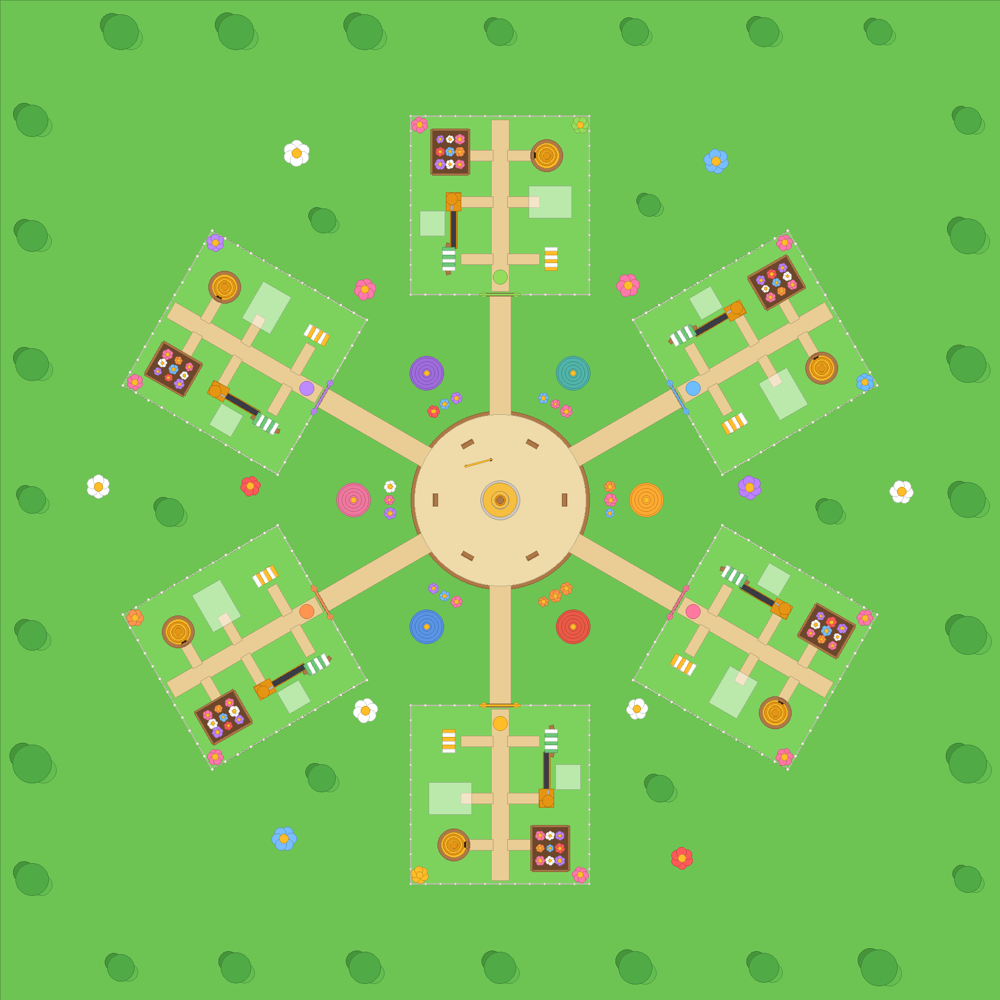
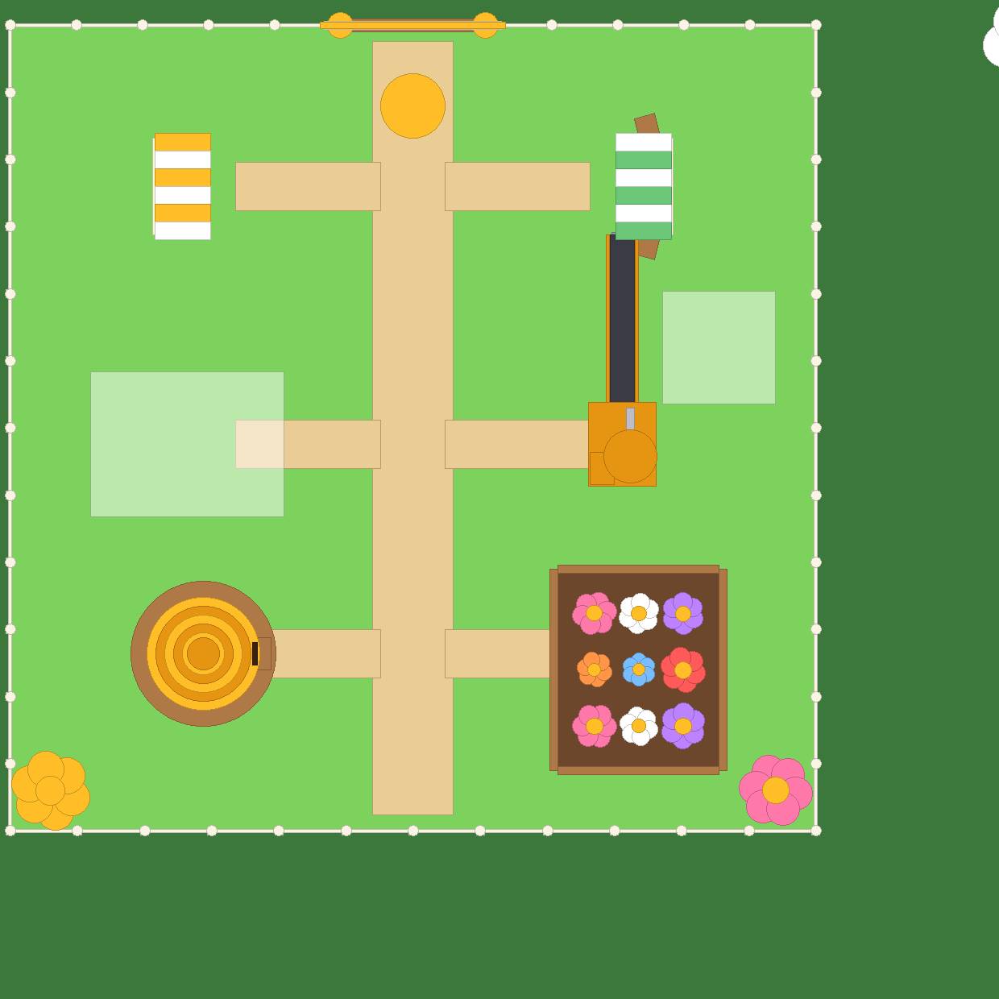

# 🍯 HONEY FARM

A colourful multiplayer bee‑farming tycoon. Players own a garden plot, buy bees, make honey, bottle and sell it, merge bees, and expand their farm.

**Status: all seven phases are done.** Map and plots, the honey loop, the Bee Shop and merging, farm upgrades, saving and offline honey, interface and introduction, and the multiplayer/quality pass. See **[TESTING.md](TESTING.md)** for exactly what was verified here and what still needs a Studio playtest.

| Whole map (top‑down, generated from the real scripts) | One plot |
|---|---|
|  |  |

## Quick start

1. Open **`HoneyFarm.rbxl`** in Roblox Studio.
2. Press **Play**. The map builds itself, you're given a farm, and you appear inside its gate.
3. To test two players: go to **Test → Clients and Servers**, set **2 Players**, and click **Start**.

The map is built by a script when the game starts, so in **Edit** mode the world looks empty. To see and edit the map in Edit mode, paste this into the Studio **command bar**:

```lua
require(game.ServerScriptService.HoneyFarm.MapBuilder).Build()
```

That creates `Workspace.HoneyFarmMap`. If a map with that name already exists, the game keeps it and doesn't rebuild it, so any edits you make there are preserved.

### Manual setup before publishing

- **Game Settings → Places → Server size: 6.** There are 6 plots. A 7th player still works: they wait in the village and get the next plot that frees up.
- Avatars on the plot signs only load in a published game or in Studio while you're signed in.

## What Phase 1 includes

| Requirement | Where |
|---|---|
| Bright map: grass, wooden fences, giant flowers, honey accents, round cartoon cottages, honey fountain, benches, trees | `MapBuilder.lua` |
| 6 personal farm plots around a central village square, each connected by a clear path | `MapBuilder.Build` |
| Each joining player is assigned a free plot automatically | `PlotService` + `PlotAllocator` |
| Owner's name and avatar on a sign above the plot entrance (readable from both sides) | `PlotService.setSign` |
| Every plot has a Hive, Flower Patch, Bee Shop, Bottling machine (with conveyor) and Honey Stand | `MapBuilder.build*` |
| Reserved space for future hives and machines ("Future Hives", "Future Machines" pads) | `Expansion` folder in each plot |
| "My Farm" button (top centre, out of the way of the mobile controls), plus the **H** key | `FarmClient.client.lua` |
| Normal third‑person camera, zoom limited to 6–70 studs so the farm stays visible | `default.project.json` |
| Visitors can walk on other farms; station prompts only appear for the owner and are also checked on the server | `FarmClient` + `PlotService.hookPrompt` |
| Plots are released when players leave, and the plot's `Temp` folder is cleared | `PlotService.onPlayerRemoving` |
| Respawning puts you back on your own farm | `PlotService.onCharacterAdded` |

## What Phase 2 includes: the honey loop

```
bees → hive storage → backpack (E at the Hive) → bottling queue (E at Bottling)
     → jar rides the conveyor (1 jar/sec, 3 s trip) → +$5 at the stand → cash (E at the Honey Stand)
```

| Requirement | Where |
|---|---|
| New player: one Starter Bee and 25 Cash | `Config.Economy`, `FarmState.new` |
| The bee flies between the flower patch and the hive (local animation, zero network cost) | `BeeFlight.client.lua` |
| Starter Bee makes 1 honey every 5 s, stored in the hive; the hive shows its amount | `FarmState.Tick`, `StationLabels.client.lua` |
| Collect with E / tap (ProximityPrompt) into a backpack of 50 | `Hive` prompt → `FarmService.actions.Hive` |
| Deposit at the bottling station; 1 honey → 1 jar per second | `actions.Bottling`, `FarmState.Tick` |
| Jars animate down the conveyor to the stand | `ConveyorJars.client.lua` (server fires `JarStarted`) |
| Each finished jar adds $5 to the stand's unclaimed balance; collect it at the stand | `FarmState.Tick`, `actions.SellStand` |
| HUD shows Cash, carried honey, hive storage, bottling progress and cash waiting at the stand | `FarmHud.client.lua` |
| Everything authoritative on the server; clients only read attributes | `FarmService` |
| Ownership **and distance** checked on the server before any station works | `PlotService.hookPrompt` |

All rates and sizes are in `Config.Economy` (`src/shared/Config.lua`). The economy itself is `src/shared/FarmState.lua`: plain data and five functions (`Tick`, `CollectHive`, `Deposit`, `CollectCash`, `AddBee`). Each one moves an exact amount from one bucket to the next, which is what stops double-counting. In Phase 5 that table is what gets saved.

Hive capacity is 50 to start, so the hive fills in about 4 minutes with one bee and honey made while it's full is lost. That's intentional pressure to come back and collect; Phase 4 upgrades raise it.

## What Phase 3 includes: Bee Shop and merging

| Requirement | Where |
|---|---|
| Shop sells Starter Bees; price starts at $25 and rises 25% per purchase (25, 31, 39, 49, 61, 76, 95…) | `FarmState.BeePrice`, `Config.Economy.BeePriceGrowth` |
| 8 active bee slots per player | `Config.Economy.BeeSlots` |
| Shop shows price, slots used, and every bee's production rate | `BeeShop.client.lua` |
| Tap two owned bees of the same tier → preview of the result (name, rate, spinning 3D model) → **Merge!** | `BeeShop.client.lua` preview panel, `FarmState.MergePreview` |
| The two bees become one bee of the next tier making 2.5× the honey | `FarmState.MergeBees`, `Config.Economy.MergeMultiplier` |
| Merge animation (sparkle burst at the hive, the new bee pops in) and a discovery banner the first time you make a tier | `MergeEffects.client.lua`, `BeeFlight` pop-in |
| Royal Bee is the top tier and can't be merged | `FarmState.NextTier` returns nil |
| Ten tiers with distinct looks, all built from your one bee model | `Config.Bees`, `BeeAppearance.lua` |

### The ten tiers

Every tier is your `BeeTemplate` recoloured by part role (head/stripes, dark stripes, wings, eyes, antennae) plus a built-in-parts accessory, so you can recognise them by shape, not just colour. Production is ×2.5 per tier; size grows a little per tier.

| # | Tier | Honey/s | What makes it recognisable |
|---|---|---|---|
| 1 | Starter Bee | 0.2 | Your original yellow-and-navy bee |
| 2 | Clover Bee | 0.5 | Green body, three-leaf clover sprouting from its head |
| 3 | Daisy Bee | 1.25 | White with golden stripes, a daisy flower hat |
| 4 | Strawberry Bee | 3.1 | Red with green stripes, seed dots and a leafy cap |
| 5 | Panda Bee | 7.8 | White and black, round ears and eye patches |
| 6 | Knight Bee | 19.5 | Steel body, helmet with visor slit and a red plume |
| 7 | Crystal Bee | 48.8 | See-through glass body, glowing cyan shards on its back, glows |
| 8 | Storm Bee | 122 | Dark grey with neon-yellow stripes, a thundercloud and lightning bolts |
| 9 | Galaxy Bee | 305 | Deep purple, neon magenta stripes, a tilted ring of stars |
| 10 | Royal Bee | 763 | Gold metal, purple stripes, a jewelled crown and a red cape |

`BeeAppearance.Build` also re-pivots every bee so its head is "forward" and its wings are "up" (the template file is saved tilted for its thumbnail), which is why flight no longer needs a yaw offset.

## What Phase 4 includes: farm upgrades

Press the **⬆ Upgrades** button (top‑right) or **U** anywhere on your own farm. Each row shows the current value, the next value and the price; maxed rows say MAX.

| Upgrade | Levels (value) | Prices to reach the next level |
|---|---|---|
| 🐝 Bee Production | ×1, 1.25, 1.5, 2, 2.5, 3, 4, 5, 6.5, 8 | $120, 300, 750, 1.8k, 4k, 9k, 20k, 45k, 100k |
| 🏠 Hive Storage | 50, 120, 250, 500, 1k, 2k, 4k, 8k, 16k, 32k honey | $80, 200, 500, 1.2k, 3k, 7k, 16k, 36k, 80k |
| 🎒 Backpack | 50, 100, 200, 400, 800, 1.6k, 3.2k, 6.4k, 12.8k honey | $60, 150, 400, 1k, 2.5k, 6k, 14k, 32k |
| 🍯 Bottling Speed | 1, 2, 3, 5, 8, 12, 20, 30, 50 jars/s | $100, 250, 600, 1.5k, 3.5k, 8k, 18k, 40k |
| ➕ Bee Slots | 8, 10, 12, 14, 16, 18, 20 bees | $200, 600, 1.5k, 4k, 10k, 25k |

All of it is the `Config.Upgrades` table in `src/shared/Config.lua`: `Levels` is the list of values (level 1 is free), `Prices[i]` is the cost of going from level i to i+1. Add or remove entries and the UI, server and visuals follow.

**Visible on the farm** (`src/server/UpgradeVisuals.lua`, built into `Plot.Temp.Upgrades`): each Hive Storage level adds a mini hive to the hive yard and a gold band to the main hive; each Bottling Speed level adds a honey tank with a pipe beside the machine; Production levels add glowing pollen orbs over the flower patch; Bee Slot levels add landing boards to the hive.

**Server rules**: you must own the plot and be standing on it; the price is taken from the same table the UI shows; maxed and unaffordable upgrades change nothing; each press buys exactly one level.

## What Phase 5 includes: saving and offline honey

| Requirement | Where |
|---|---|
| Saves Cash, bees (ids + tiers), upgrades, discovered tiers, carried honey, hive honey, processing inventory (bottling queue, progress, jars on the belt), unclaimed cash and the save timestamp | `FarmState.Serialize` |
| Loads before any economy action: the farm (and its prompts, shop and upgrades) doesn't exist until the DataStore answers; the HUD shows "loading…" | `FarmService.startFarm`, `FarmLoading` attribute |
| Autosave every 60 s, save on leave, save everyone on server shutdown (`BindToClose`) | `FarmService.Tick`, `stopFarm`, `SaveAll` |
| A failed load never overwrites progress: the player gets a clearly labelled temporary farm and nothing is written that session | `Farm.CanSave`, `SaveService.Load` returns ok=false |
| A newer save on another server is never overwritten (`UpdateAsync` compares `SavedAt`) | `SaveService.Save` |
| Bad or old data is clamped instead of crashing (unknown tiers dropped, duplicate ids repaired, levels clamped, negatives zeroed, a farm always has a bee) | `FarmState.Deserialize` |
| Offline honey = saved production rate × time away, capped at 8 hours and by free hive room; credited once (the timestamp moves on save) | `FarmState.ApplyOffline`, `Config.Save.OfflineCapHours` |
| Welcome-back card: time away, honey made, "hive filled up" or "counts up to 8 hours" | `WelcomeBack.client.lua` |
| Studio without API access (or an outage): the game plays on temporary progress and tells the player and the Output window | `SaveService.Start`, `SaveService.Reason` |

Settings are in `Config.Save`: `StoreName` (change it to reset everyone), `AutosaveInterval`, `OfflineCapHours`, `LoadRetries`.

**To save in Studio**: Game Settings → Security → **Enable Studio Access to API Services**. Without it, you'll see the "Saving is unavailable this session" message, which is expected.

## What Phase 6 includes: interface and introduction

| Requirement | Where |
|---|---|
| Introduction in five steps: collect honey → bottle it → collect cash → buy a second bee → first merge. The **server** advances a step only when that action really succeeds, and the step is saved | `Config.Tutorial.Steps`, `FarmState.TutorialStep`, `FarmService.tutorial` |
| The next station glows (`Highlight`) with a bobbing arrow; step 1 says "your bee is making honey…" while the hive is still empty | `Tutorial.client.lua` |
| Finishing pays a $50 bonus (`Config.Tutorial.Reward`) | `FarmService.tutorial` |
| Collection effects: honey drops stream from the hive into you, a swirl into the machine on deposit, gold coins + floating "+$X" at the stand, a fanfare on merges | `Effects.client.lua`, driven by the server's `Feedback` remote so effects only play for accepted actions |
| Sounds: collect, deposit, cash, merge and UI clicks use audio that ships **inside the Roblox client** (`rbxasset://sounds/…`), so nothing depends on an asset id I couldn't verify. Bee hum is a config slot (`Config.Sounds.Buzz`): paste a Creator Store loop id and every bee gets a quiet, slightly different-pitched buzz audible up close | `Config.Sounds`, `BeeSounds.client.lua` |
| Collection book (**📖 Bees** button / **B**): ten cards; discovered tiers show a spinning model, description and rate; undiscovered ones are dark silhouettes with "???" and a hint ("Merge two Clover Bees to find it") | `CollectionBook.client.lua`, reads the plot's `Discovered` attribute |
| Readable text (Fredoka One headings, Gotham Bold body), 54 px buttons, one modal panel at a time | all client UIs |
| Clear of mobile controls: stats top‑left, My Farm + tutorial card top‑centre, Bees/Upgrades top‑right, toasts below those; panels are centred modals; nothing sits bottom‑left (thumbstick) or bottom‑right (jump) | layout in each client script |

Keys: **H** My Farm, **U** Upgrades, **B** Bee collection, **Esc** closes any panel.

## What Phase 7 includes: multiplayer and quality checks

- **Server authority audit**: every money/honey/bee/upgrade change runs in `FarmService`; clients only read attributes; remotes carry no plot argument so they can only touch the sender's own farm; ownership, distance, price and capacity are all checked server‑side. Full table in [TESTING.md](TESTING.md#server-authority-audit-phase-7).
- **Flood protection**: `RateLimiter` drops more than 25 remotes/s or 25 station presses/s per player before any economy code runs (`Config.Limits`). The economy was already atomic; this stops an exploiter from burning server time.
- **Lightweight visuals**: bee flight is client‑only and now distance‑culled (frozen past 220 studs, ¼ rate from 90–220), jars are local parts capped at 12 per plot, attributes replicate only on change.
- **Two‑player scenario** (`tests/phase7.scenario.luau`): cross‑ownership on all five stations, full storage, insufficient funds, 100‑press spam bursts on hive/shop/upgrades/merge with exact expected outcomes, per‑player limiting, leave and rejoin, independent offline rewards, and a queued 7th player loading his own save.
- **Report**: [TESTING.md](TESTING.md) lists what was actually tested (with counts), the authority audit, performance notes, the Studio checklist and a release checklist.

### Hooks for later phases

- `PlotService.GetPlot(player)`, `PlotService.IsOwner(player, instance)`, and the `PlotAssigned`/`PlotReleased` events.
- `FarmService.GetState(player)` returns the live `FarmState`; `PlotService.StationTriggered` fires `(player, plot, station)` only after the owner + distance checks.
- `Plot.Temp` holds the bee models and is cleared automatically when the owner leaves.
- Marker parts: `Hive/BeeExit`, `FlowerPatch/FlowerSpots/Spot1‑9`, `Bottling/DepositPoint`, `Conveyor/ConveyorStart`/`ConveyorEnd`.
- `ReplicatedStorage.Assets.BeeTemplate` is your original bee model: the Starter Bee, the shop display bee, and the base for the 10 tiers.

## Project layout (Rojo)

```
default.project.json          how files map into the game
HoneyFarm.rbxl                 built place file, ready to open
src/shared/   → ReplicatedStorage.HoneyFarm   Config, PlotAllocator, FarmState, BeeAppearance
src/server/   → ServerScriptService.HoneyFarm  Main, MapBuilder, PlotService, FarmService, UpgradeVisuals, SaveService, RateLimiter
src/client/   → StarterPlayerScripts.HoneyFarm FarmClient, FarmHud, StationLabels, BeeFlight, ConveyorJars, BeeShop, MergeEffects,
                                                Upgrades, WelcomeBack, Tutorial, Effects, CollectionBook, BeeSounds
assets/BeeTemplate.rbxm → ReplicatedStorage.Assets.BeeTemplate
tests/                          offline tests (see below)
```

Rebuild the place file after editing the scripts: `rojo build default.project.json -o HoneyFarm.rbxl` (Rojo 7.7+). Or run `rojo serve` and use the Rojo Studio plugin to sync live.

You can change all the sizes, colours and the plot count in `src/shared/Config.lua`.

## Testing

| Test | How | Result |
|---|---|---|
| Plot assignment logic: separate plots, no double assignment, release, queue when full, rejoin | `luau tests/PlotAllocator.spec.luau` | 17/17 pass |
| Economy logic: production rate, hive cap and lost honey, backpack cap, 1 jar/sec, $5 per jar, collecting twice never pays twice, a 3,000‑step conservation run with random frame times, shop prices and exact charges, 8‑slot cap, merge rules (same bee, missing bee, different tiers, top tier), ×2.5 production, discovery flags, upgrade levels/values/prices, maxed and unaffordable refusals, multiplier, faster bottling, bigger backpack, a 9th bee after the slot upgrade, base values without an upgrade table, save round‑trip (money, honey, bees with ids, upgrades, processing, discoveries), hostile data clamped, offline honey (rate × time, 8‑hour cap, hive‑room cap, credited once), introduction steps (no skipping, saved, clamped) | `luau tests/FarmState.spec.luau` | 98/98 pass |
| Full Phase 1 scenario: the **real** server scripts run against a small mock of the Roblox engine. Builds the map, two players join, spawn on separate farms, use **My Farm** (including spam and visiting), respawn, owner‑only stations, leave and clear the plot, rejoin, a full server with a 7th player queued | `python3 tests/run_sim.py --luau <path to luau> --render out/` | 123/123 pass |
| Full Phase 7 scenario (two players at once): see TESTING.md | `python3 tests/run_sim.py --luau <luau> --scenario tests/phase7.scenario.luau` | 37/37 pass |
| Rate limiter: window, reset, per‑key buckets, a 100‑call burst passes exactly 25 | `luau tests/RateLimiter.spec.luau` | 8/8 pass |
| Full Phase 6 scenario: steps point at real stations; built‑in sound ids; pressing other stations early doesn't skip; empty hive doesn't count; collect → deposit → cash → buy → merge each advance exactly one step with the matching Feedback event (kind, amount, station); finishing pays the bonus; finished stays finished; step saved and restored; collection data lists Starter + Clover; a second player starts at step 1 | `python3 tests/run_sim.py --luau <luau> --scenario tests/phase6.scenario.luau` | 32/32 pass |
| Full Phase 5 scenario (in‑memory DataStore): new player loads empty; leaving saves everything with a timestamp; rejoin 2 h later restores progress, respawns bee models and upgrade visuals, credits offline honey (2 bees × 0.2/s × 7200 s = 2880, capped to the hive's free room) with one welcome card; rejoin 10 s later credits nothing; 30 h away counts as 8 h; autosave after 60 s; a load that fails all retries gives a temporary farm and never writes; one transient failure still loads; a newer save elsewhere is not overwritten; BindToClose saves everyone; unavailable DataStores → temporary progress, player told, nothing written | `python3 tests/run_sim.py --luau <luau> --scenario tests/phase5.scenario.luau` | 29/29 pass |
| Full Phase 4 scenario: config sanity (prices per step, values rise); refused without cash and from the village; hive storage → capacity 120/250 with 1/2 mini hives and exact charges; bottling speed 2 → 2 jars/s and a tank module; production ×1.25 + pollen orb; backpack 100; 8/8 slots message → slot upgrade → 9th bee; two rapid presses = two levels at listed prices; maxed refused; garbage ids ignored; honey conservation with upgrades; other player can't upgrade your farm; leaving clears visuals; next owner starts at level 1 | `python3 tests/run_sim.py --luau <luau> --scenario tests/phase4.scenario.luau` | 40/40 pass |
| Full Phase 3 scenario: all ten tiers build from a stand‑in of your template (role classification, accessory present, one head, scaled, unique look, no camera); E at the shop opens the UI; buy at exactly $25; refused with $0, from far away, and at 8 slots; ten rapid presses buy exactly 6 bees at the exact rising prices; merge two Starters → Clover (parents' models removed, new model spawned, production = 6×0.2 + 0.5, discovery event + message); refused merges change nothing (different tiers, same bee, missing bees, garbage args); second Clover isn't a discovery; two Royals can't merge; another player's buy never touches your farm; leaving clears everything | `python3 tests/run_sim.py --luau <luau> --scenario tests/phase3.scenario.luau` | 117/117 pass |
| Full Phase 2 scenario: new player gets 25 Cash + a bee model; produce → collect → deposit → 50 jars → $250 → collect; empty hive, full hive, full backpack, double‑press deposit, double collect, press from across the map (ignored), visitor refused, two farms producing independently, leaving clears state, next owner starts fresh | `python3 tests/run_sim.py --luau <luau> --scenario tests/phase2.scenario.luau` | 41/41 pass |
| Type check against the Roblox API definitions | `luau-lsp analyze` with Roblox definitions and a Rojo sourcemap | no errors |
| Place file builds | `rojo build` | ok |

**Still needs a real Roblox Studio playtest.** The mock above isn't a physics or rendering engine. Please check:
- [ ] With 2 players, each player appears inside their own gate, and the signs show their name and avatar.
- [ ] Walking, jumping and the camera feel comfortable on paths and through gates. Nothing blocks a path.
- [ ] The **My Farm** button and the **H** key work. On a phone, the button doesn't overlap the thumbstick or jump button.
- [ ] Visitors don't see station prompts on someone else's farm. The owner does (key **E**, or tap).
- [ ] When a player leaves, their sign resets to "Free Farm", and a new joiner can take that plot.
- [ ] Part count and frame rate are fine on mobile (the map is about 2,400 anchored parts).

Phase 2 (needs a real client, the mock has no rendering):
- [ ] The bee visibly flies between the flower patch and the hive and faces the way it moves (if it flies sideways, change `Config.BeeFlight.YawOffset`).
- [ ] The hive label counts up: 1 honey every 5 seconds.
- [ ] Walk up to the hive: the **E / tap** prompt says "Collect Honey" and the HUD's CARRYING bar fills.
- [ ] Deposit at Bottling: jars appear one per second and slide down the conveyor to the stand; the stand label shows "$X ready!".
- [ ] Collect at the stand: the Cash number pops. Numbers in the HUD, the labels and the chat messages all agree.
- [ ] Try it on a phone-sized viewport: the stats panel (top‑left) doesn't cover the thumbstick.

Phase 3 (needs a real client):
- [ ] Each of the ten tiers looks right and distinct. Merge up a few (or in Studio's command bar, give yourself bees: `require(game.ServerScriptService.HoneyFarm.FarmService).GetState(game.Players.YourName):AddBee("Galaxy")`). If an accessory floats off the bee, the template's part layout differs from my decoded copy; the offsets are all at the top of `BeeAppearance.lua`.
- [ ] Bees fly head‑first with wings up. If not, the forward/up axes in `BeeAppearance.Build` ("Canonical pivot") need swapping.
- [ ] The Bee Shop panel fits a phone screen, cards are easy to tap, the preview bee spins, and the panel closes when you walk away or press Esc.
- [ ] The merge sparkle burst appears at the hive, the new bee pops in, and the "New bee discovered!" banner slides down.

Phase 4 (needs a real client):
- [ ] The Upgrades panel fits a phone screen and the ⬆ button doesn't collide with the Roblox top bar.
- [ ] Mini hives sit on the "Future Hives" pad and tank modules on the "Future Machines" pad without clipping the fence or paths; the gold bands wrap the main hive at sensible heights.
- [ ] HUD bars re-scale when capacity grows (e.g. hive 50 → 120).

Phase 5 (needs a real DataStore: a published place, or Studio with API access enabled):
- [ ] Play, leave, rejoin: cash, bees, upgrades and carried honey are back; the welcome card shows a sensible "away" time and honey amount.
- [ ] Leave for 10+ minutes and rejoin: the hive has offline honey in it and the card says so.
- [ ] With API access *off* in Studio, the "Saving is unavailable" message appears and the Output names the setting to flip.
- [ ] Two‑player test: both players' saves are independent.

Phase 6 (needs a real client):
- [ ] New player: the tutorial card reads well, the hive glows with an arrow once it has honey, and each step flips to the next station as you do it.
- [ ] Effects: honey drops fly into you, coins pop at the stand with "+$X", sounds play (they're built‑in Roblox client sounds; swap any in `Config.Sounds`).
- [ ] Paste a bee‑buzz loop id into `Config.Sounds.Buzz` and check the hum is quiet and only audible near bees.
- [ ] Collection book on a phone: cards readable, silhouettes obviously "locked".
- [ ] On a phone, no panel or button overlaps the thumbstick or jump button.

## Roadmap

- [x] **1. Map and player plots**
- [x] **2. First playable honey loop**: Starter Bee, 25 Cash, hive storage, backpack (50), bottling at 1 jar/sec, conveyor, 5 Cash per jar, collect at the stand
- [x] **3. Bee shop and merging**: 10 tiers (Starter, Clover, Daisy, Strawberry, Panda, Knight, Crystal, Storm, Galaxy, Royal); each merge is ×2.5 production
- [x] **4. Farm upgrades**: production, hive storage, backpack, bottling speed, bee slots
- [x] **5. Saving and offline honey**: DataStore, autosave, offline earnings capped at 8 hours
- [x] **6. Interface and introduction**: tutorial, collection book, effects and sounds
- [x] **7. Multiplayer and quality checks**: server authority, anti‑spam, two‑player tests
- Later: flower combos, Royal Jelly rebirths, quests, seasonal bees, hive skins, co‑op events
